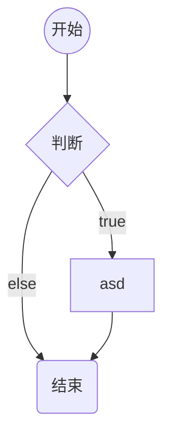
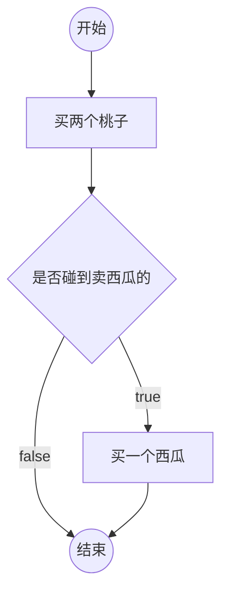
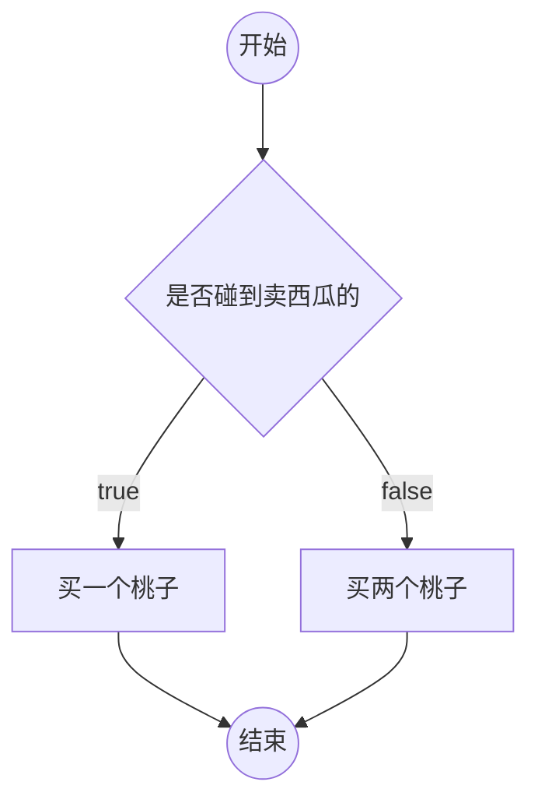

# 流程图

一套标准的图形，用于描述程序的逻辑。

通常用流程图分析程序的流程。

## 在markdown中画流程图

```mermaid
graph TD
start((开始)) -->
if{判断}
if--true-->A[asd]
if--else-->ed(结束)
A-->ed
```

### 练习

```mermaid
graph TD
st((开始))-->buyPeach[买两个桃子]
buyPeach-->if{是否碰到卖西瓜的}
if--true-->buyXigua[买一个西瓜]
if--false-->ed((结束))
buyXigua-->ed((结束))
```

```mermaid
graph TD
st((开始))-->if{是否碰到卖西瓜的}
if--true-->买一个桃子
if--false-->买两个桃子
买一个桃子-->ed((结束))
买两个桃子-->ed
```