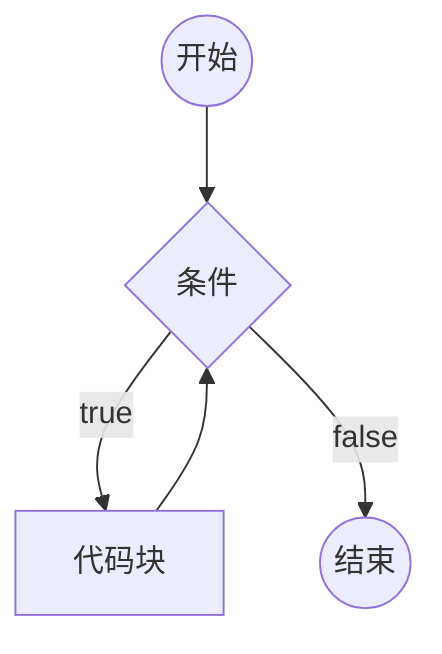
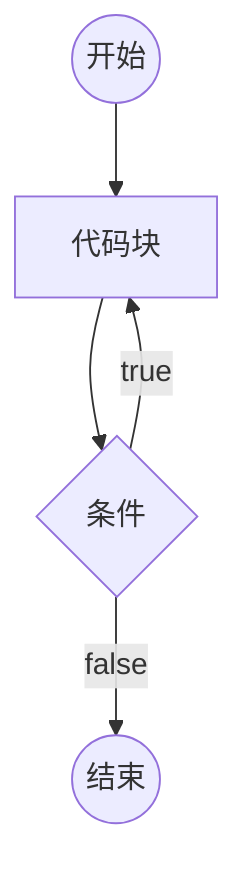
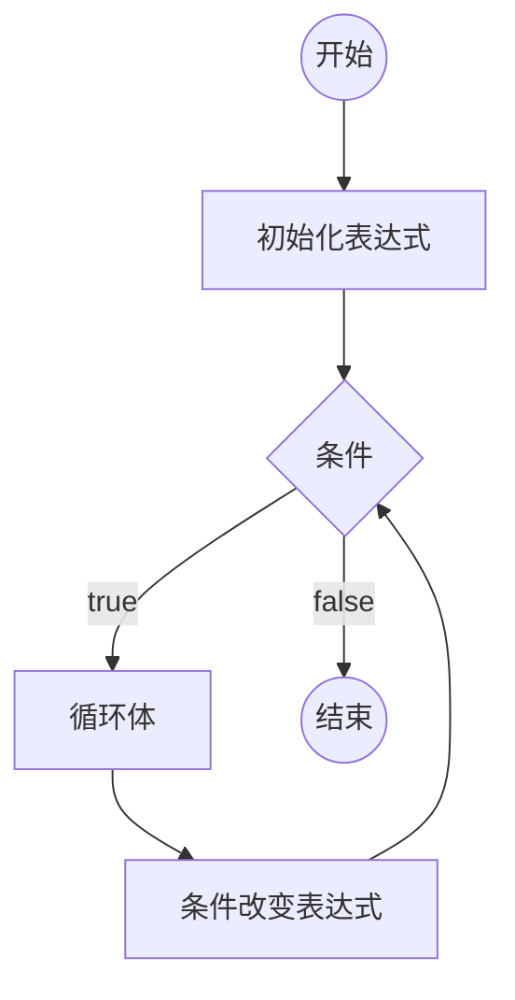

# 循环

重复的运行一段代码

JS支持3种循环结构：while循环、do-while循环、for循环

## while循环

```js
while(条件) {
  代码块(循环体)
}
```



```js
// 输出100个hello world
var i = 0;
while(i < 100) {
  console.log("hello world");
  i++;
}
```

死循环：条件永远满足，永远无法退出循环。

## do-while循环

```js
do {
  循环体
} while(条件);
```



```js
// 输出100个hello world
var i = 0;
do {
  console.log("hello world");
  i++;
}
while(i < 100);
```

## for循环

```js
for(初始化表达式; 条件; 条件改变表达式) {
  循环体
}
```



```js
// 输出100个hello world
for (var i = 0; i < 100; i++) {
  console.log("hello world");
}

// 输出1-100的所有数字
for (var i = 1; i <= 100; i++) {
  console.log(i);
}

// 输出100-1的所有数字
for (var i = 100; i >= 1; i-) {
  console.log(i);
}

// 输出1-100的所有奇数
for (var i = 1; i <= 100; i++) {
  if (i % 2 !== 0) {
    console.log(i);
  }
}
```

## 循环种的关键字

循环控制语句

- break; 跳出循环
- continue; 停止当前循环体，进入下一次循环


```js
var i = 0;
while(i < 100) {
  console.log();
  if (i === 9) {
    break;
  }
  i++;
}
```